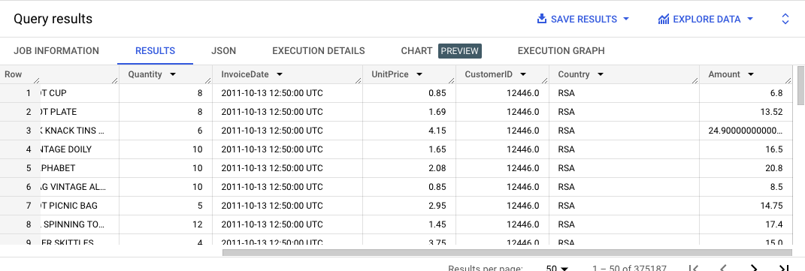
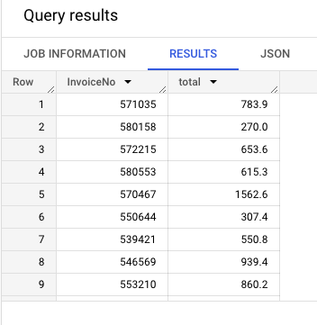
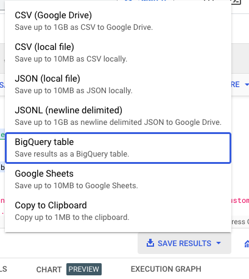
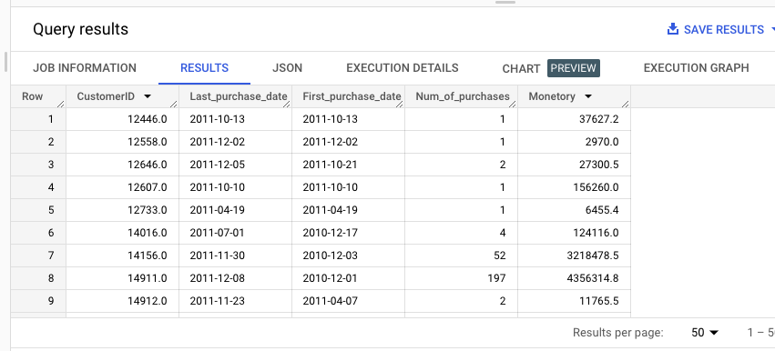
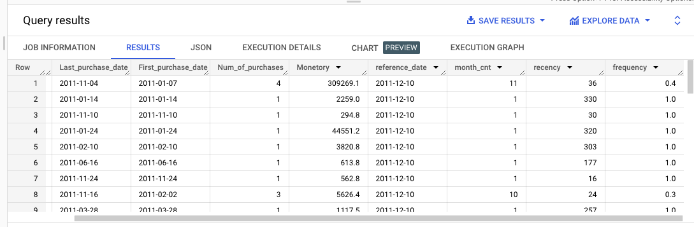
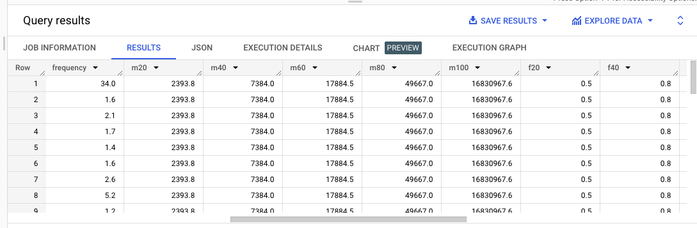
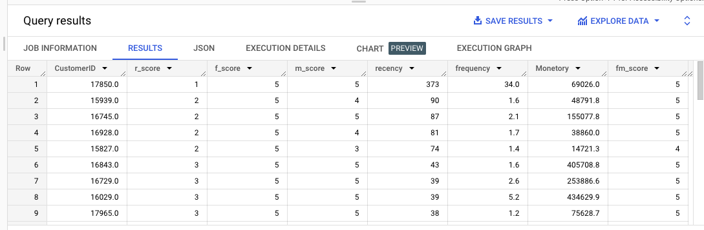
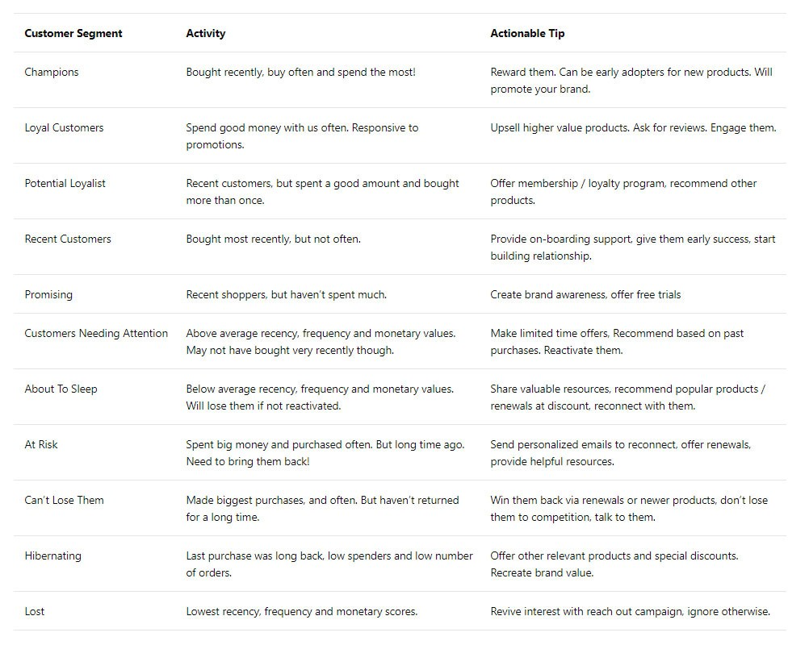
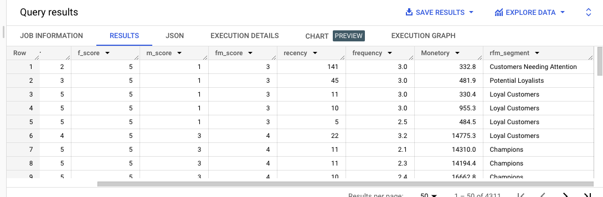

# Customer Segmentation

## Project Title : 
Customer Segmentation - RFM Analysis

## Problem Statement:
We will be performing a RFM analysis for a chain of retail stores that sells a lot of different items and categories.

The stores need to adjust their marketing budget and have better targeting of customers so they need to know which customers to focus on and how important they are to the
business.

## What is RFM Score?

We all know that valuing customers based on a single parameter is not correct. The biggest value customer may have only purchased once or twice in a year, or the most frequent
purchaser may have a value so low that it is almost not profitable to service them.

One parameter will never give you an accurate view of your customer base, and you’ll ignore customer lifetime value.

We calculate the RFM score by attributing a numerical value for each of the criteria.
The customer gets more points -
- if they bought in the recent past,
- bought many times
- if the purchase value is larger.
Combine these three values to create the RFM score


This RFM score can then be used to segment your customer data platform (CDP).
- Ultimately, we will end up with 5 bands for each of the R, F and M-values, this can be reduced to bands of 3 if the variation of your data values is narrow.
- The larger the score for each value the better it is. A final RFM score is calculated simply by combining individual RFM score numbers.
- There are many different permutations of the R,F & M scores, 125 in total, which is too many to deal with on an individual basis and many will require similar
marketing responses.

## Data Preview

Attribute Information:
- InvoiceNo: Invoice number. Nominal, a 6-digit integral number uniquely assigned to each transaction. If this code starts with letter 'c', it indicates a cancellation.
- StockCode: Product (item) code. Nominal, a 5-digit integral number uniquely assigned to each distinct product.
- Description: Product (item) name. Nominal.
- Quantity: The quantities of each product (item) per transaction. Numeric.
- InvoiceDate: Invoice Date and time. Numeric, the day and time when each transaction was generated.
- UnitPrice: Unit price. Numeric, Product price per unit in sterling.
- CustomerID: Customer number. Nominal, a 5-digit integral number uniquely assigned to each customer.
- Country: Country name. Nominal, the name of the country where each customer resides.

## RFM Segmentation in BigQuery

The RFM Segmentation can be executed using these five steps:
1. Data processing
2. Compute for recency, frequency, and monetary values per customer
3. Determine quantiles for each RFM metric
4. Assign scores for each RFM metric
5. Define the RFM segments using the scores in step 4

## Prerequisites
- Access to BigQuery
- Data set (Which will be available in this repo.)
- SQL Knowledge

## Data Cleaning

- Checking Null values / Missing values
- Checking duplicate values
Code is available in data-cleaning.ipynb file

## Data Preprocessing

#### Adding the data to BigQuery:
Create a new dataset and upload ‘sales_final.csv’ as a new table.
We created a dataset named `customer_segmentation` and the table name is `sales`.

Now if we look at the data we can see that there are products that have been bought in quantities more than one and we have unit price for those products but we do not have
the total cost of that product. So the first thing we’re gonna do is find the total cost for that product i.e., quantity * unit price -

```
SELECT *, (Quantity * UnitPrice) As Amount FROM `customer_segmentation.sales`
```

Output


Now that we have got the total cost for each product we need to find out the amount spent on each visit. For each invoice id there may be different products, and till now we have calculated the total for each product, but we do not have the total bill amount for individual invoice ids. For this we use the above query and create a CTE. Then group it by invoice id and sum the total cost, getting the actual bill amount.

```
WITH bills AS (
SELECT *, (Quantity * UnitPrice) As Amount FROM `customer_segmentation.sales`
)

SELECT InvoiceNo, ROUND(SUM(bills.Amount),1) AS total FROM bills GROUP BY InvoiceNo;
```

Output


Save this data as a `bill` table in the same dataset by using the save button below the query editor.



## Compute for recency, frequency and monetary values per customer :

- For monetary, this is just a simple sum of sales,
- while for frequency, this is a count of distinct invoice numbers per customer for the time they have been a customer ie: the number of separate purchases/ num
of months they have been a customer. So we will get the first and last purchase for all customers and also the number of purchases
- For calculating recency we will first get the last purchase for each customer

We will join the `bill` table that we saved with the `sales` table and add the total cost on the customer level for monetary value.

```
SELECT S.CustomerID,
Date(MAX(S.InvoiceDate)) AS Last_purchase_date,
Date(MIN(S.InvoiceDate)) AS First_purchase_date,
COUNT(DISTINCT(S.InvoiceNo)) AS Num_of_purchases,
ROUND(SUM(total),1) AS Monetory
FROM customer_segmentation.sales AS S 
LEFT JOIN customer_segmentation.bill AS B 
ON S.InvoiceNo = B.InvoiceNo
GROUP BY S.CustomerID
```

Output


For recency, we chose a reference date, which is the most recent purchase in the dataset. In other situations, one may select the date when the data was analyzed
instead. 
After choosing the reference date, we get the date difference between the reference date and the last purchase date of each customer. This is the recency value for that
particular customer.
For frequency we calculate the months the person has been a customer by difference in first and last purchase +1 ( for when first and last month are same and the customer should be
considered a customer for at least 1 month)

```
WITH rfm AS (
SELECT S.CustomerID,
Date(MAX(S.InvoiceDate)) AS Last_purchase_date,
Date(MIN(S.InvoiceDate)) AS First_purchase_date,
COUNT(DISTINCT(S.InvoiceNo)) AS Num_of_purchases,
ROUND(SUM(total),1) AS Monetory
FROM customer_segmentation.sales AS S 
LEFT JOIN customer_segmentation.bill AS B 
ON S.InvoiceNo = B.InvoiceNo
GROUP BY S.CustomerID
)

SELECT *, DATE_DIFF( reference_date,Last_purchase_date, day) AS recency,
ROUND(Num_of_purchases/month_cnt,1) AS frequency
FROM (
SELECT *, MAX(rfm.Last_purchase_date) OVER()+1 AS reference_date,
DATE_DIFF(rfm.Last_purchase_date,rfm.First_purchase_date,month)+1 AS month_cnt
FROM rfm
);
```

Output


Now that we have the RFM data we can save it as another table named `rfm`.

## Determine quintiles for each RFM metric

The next step would be to group the customers into quintiles in terms of their RFM values — we divide the customers into 5 equal groups, according to how high and low  they scored in the RFM metrics.
The main advantage of using percentile is we do not have to change or set the values. It will be automatically calculated.

#### What is a Quintile?
- A quintile is a 1/5th (20 percent) portion of the whole. In statistics, it’s a population or sample divided into five equal groups, according to values of a
particular variable. Quintiles are like percentiles, but instead of dividing the data into 100 parts, you divide it in 5 equal parts. Quintiles work with any industry
since the data itself defines the ranges; they distribute customers evenly. We do this for each of recency, frequency and monetary values per customer.

I used BigQuery’s APPROX_QUANTILES() to achieve this.

#### How does APPROX_QUANTILES() work?

- Returns the approximate boundaries for a group of expression values, where number represents the number of quantiles to create.
- This function returns an array of number+1 elements, where the first element is the approximate minimum and the last element is the approximate maximum.

NOTE : Approximate aggregate functions are scalable in terms of memory usage and time, but produce approximate results instead of exact results.

- OFFSET() accesses an ARRAY element by position and returns the element. The approximate_quantiles will return an array for each percentile and for
creating quintiles out of it we will need values at 20, 40 and so on. We save those values as m20, m40 for monetary and f, r for frequency and recency respectively.

```
SELECT
a.*,
--All percentiles for MONETARY
b.percentiles[offset(20)] AS m20,
b.percentiles[offset(40)] AS m40,
b.percentiles[offset(60)] AS m60,
b.percentiles[offset(80)] AS m80,
b.percentiles[offset(100)] AS m100,
--All percentiles for FREQUENCY
c.percentiles[offset(20)] AS f20,
c.percentiles[offset(40)] AS f40,
c.percentiles[offset(60)] AS f60,
c.percentiles[offset(80)] AS f80,
c.percentiles[offset(100)] AS f100,
--All percentiles for RECENCY
d.percentiles[offset(20)] AS r20,
d.percentiles[offset(40)] AS r40,
d.percentiles[offset(60)] AS r60,
d.percentiles[offset(80)] AS r80,
d.percentiles[offset(100)] AS r100
From `customer_segmentation.rfm` a,
(Select APPROX_QUANTILES(Monetory,100) as percentiles
from `customer_segmentation.rfm`) b ,
(Select APPROX_QUANTILES(frequency,100) as percentiles
from `customer_segmentation.rfm`) c,
(Select APPROX_QUANTILES(recency,100) as percentiles
from `customer_segmentation.rfm`) d;
```
Output:


Again, we save these as a new table named `rfm_groups`.

## Assign scores for each RFM metric :
Now that we know how each customer fares relative to other customers in terms of RFM values, we can now assign scores from 1 to 5.

Just keep in mind that while with F and M, we give higher scores for higher quintiles, R should be reversed as more recent customers should be scored higher in this metric.

Frequency and Monetary value are combined (as both of them are indicative to purchase volume anyway) to reduce the possible options from 125 to 50.

We will use CASE to get values and assign scores accordingly, so we just get the data from the `quintiles` table that we stored assign scores.

```
SELECT CustomerID, r_score, f_score, m_score 
recency, frequency,Monetory,
CAST(ROUND((f_score + m_score) / 2, 0) AS INT64) AS fm_score
FROM (
Select * ,
CASE WHEN Monetory <= m20 THEN 1
WHEN Monetory <= m40 AND Monetory > m20 THEN 2
WHEN Monetory <= m60 AND Monetory > m40 THEN 3
WHEN Monetory <= m80 AND Monetory > m60 THEN 4
WHEN Monetory <= m100 AND Monetory > m80 THEN 5
END AS m_score,
CASE WHEN frequency <= f20 THEN 1
WHEN frequency <= f40 AND frequency > f20 THEN 2
WHEN frequency<= f60 AND frequency > f40 THEN 3
WHEN frequency <= f80 AND frequency> f60 THEN 4
WHEN frequency <= f100 AND frequency > f80 THEN 5
END AS f_score,
--Recency scoring is reversed
CASE WHEN recency <= r20 THEN 5
WHEN recency <= r40 AND recency > r20 THEN 4
WHEN recency <= r60 AND recency > r40 THEN 3
WHEN recency <= r80 AND recency > r60 THEN 2
WHEN recency <= r100 AND recency > r80 THEN 1
END AS r_score
From `customer_segmentation.rfm_groups`
)
```
Output:


Now you can save this as another table or create a CTE named score for this and use it for further calculations.

## Define the RFM segments using these scores :
The next step is to combine the scores we obtained to define the RFM segment each customer will belong to.
As there are 5 groups for each of the R, F, and M metrics, there are 125 potential permutations.

Analysis of the customer RFM values will create some standard segments. The `UK Data & Marketing Association (DMA)` laid out 11 segments, and specified marketing strategies according to their respective characteristics:



- For example, in the Champions segment, customers should have bought recently, bought often, and spent the most. Therefore, their R score should be 5 and their combined FM score should be 4 or 5.
- On the other hand, Can’t Lose Them customers made the biggest purchases, and often, but haven’t returned for a long time. Hence their R score should be 1, and FM score should be 4 or 5.

```
SELECT CustomerID, r_score, f_score, m_score , fm_score,
recency, frequency,Monetory,
CASE WHEN (r_score = 5 AND fm_score = 5)
OR (r_score = 5 AND fm_score = 4)
OR (r_score = 4 AND fm_score = 5)
THEN 'Champions'
WHEN (r_score = 5 AND fm_score =3)
OR (r_score = 4 AND fm_score = 4)
OR (r_score = 3 AND fm_score = 5)
OR (r_score = 3 AND fm_score = 4)
THEN 'Loyal Customers'
WHEN (r_score = 5 AND fm_score = 2)
OR (r_score = 4 AND fm_score = 2)
OR (r_score = 3 AND fm_score = 3)
OR (r_score = 4 AND fm_score = 3)
THEN 'Potential Loyalists'
WHEN r_score = 5 AND fm_score = 1 THEN 'Recent Customers'
WHEN (r_score = 4 AND fm_score = 1)
OR (r_score = 3 AND fm_score = 1)
THEN 'Promising'
WHEN (r_score = 3 AND fm_score = 2)
OR (r_score = 2 AND fm_score = 3)
OR (r_score = 2 AND fm_score = 2)
THEN 'Customers Needing Attention'
WHEN r_score = 2 AND fm_score = 1 THEN 'About to Sleep'
WHEN (r_score = 2 AND fm_score = 5)
OR (r_score = 2 AND fm_score = 4)
OR (r_score = 1 AND fm_score = 3)
THEN 'At Risk'
WHEN (r_score = 1 AND fm_score = 5)
OR (r_score = 1 AND fm_score = 4)
THEN 'Cant Lose Them'
WHEN r_score = 1 AND fm_score = 2 THEN 'Hibernating'
WHEN r_score = 1 AND fm_score = 1 THEN 'Lost'
END AS rfm_segment
FROM customer_segmentation.scores;
```


After this step, each customer should have an RFM segment assignment like this.


This type of segmentation focuses on the actual buying behavior and ignores the differences in motivations, intentions, and lifestyles of consumers.
RFM is nonetheless a useful start-off point, and because of its simplicity can be executed fast and in an automated way, giving companies the power to act and decide on business strategies swiftly.

